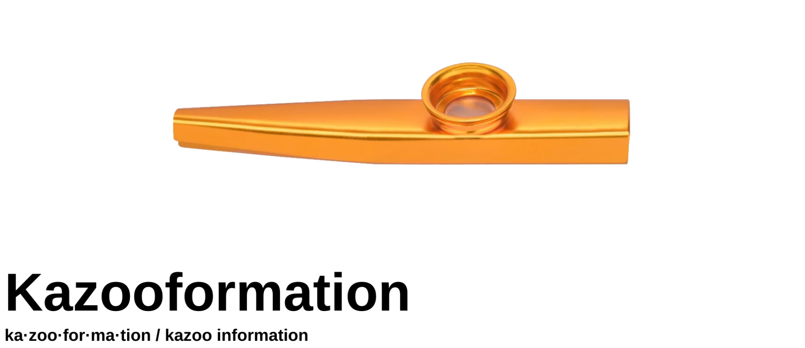

# Kazooformation



An abstract data storage, modulation, and demodulation system. Presented in an
engaging way 

## Build & Run

Simple CMake/GCC build system

Build Essential, Lib FFTW-3, and Pulse Audio must be installed.

```bash
# Optional: install prerequisite packages
# @todo the FFTW-3 lib links to KTL but it cannot find the header
sudo apt install libgtest-dev libpulse-dev libfftw3-dev

# Create build dir
mkdir build && cd build

# CMake Configure
cmake ..

# Build
make

# Launch Terminal Client
./kazoo_connect

# Set Pulse Audio Defaults
pactl list sinks  
pactl set-default-sink 1 # Use the device from the list command instead of `1`

pactl list sources
pactl set-default-source 1 # Use the device from the list command instead of `1`

# Launch Web Server
./kazoo_connect_server
```

## Run With Optional Web Server

The executable `kazoo_connect_server` runs a *very basic* http server that can
be used alongside a react app found in `./src/web_client`. This can be run
like any other NPM project.

```bash
npm install
npm run start
```

## Attribution/Licensing

icon `src/web_client/public/soundwave.svg` is from `https://composeicons.com/icons/bootstrap/soundwave`, it falls under the MIT license.