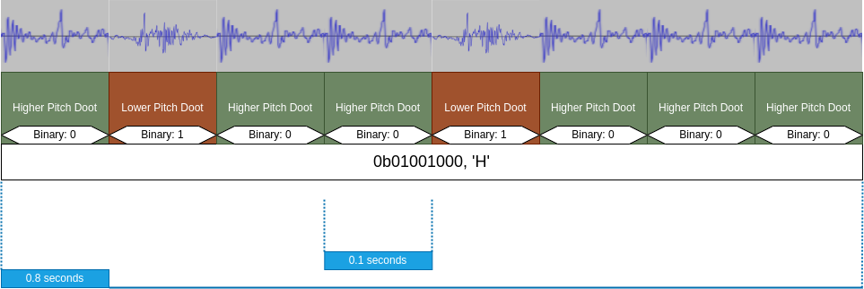

# Kazooformation


An engaging teaching tool for the lowest layer of the OSI model. Send and receive data via sound using kazoo noises!

<!-- An abstract data storage, modulation, and demodulation library using kazoo sounds. -->

<!-- This is an engaging teaching tool for the lowest layer of the OSI model. -->

<!-- <p align="center"> -->
  <!--  -->
<!-- </p> -->

## Project Features
<p align="center">
  
</p>

### Kazoo Translation Layer (KTL)

The primary component of this project is the Kazoo Translation Layer (KTL), which is a C++ library that converts any serialized data to and from kazoo sounds using various modulation techniques.

Here is an example of how data is translated *into* kazoo sounds using one of the basic binary models:




And this is what that sounds like:

https://github.com/user-attachments/assets/2616b039-56e6-47bb-b4c9-5c690887d0fb


### Kazoo Connect

Kazoo Connect is an application example of the KTL library. It's a bare bones chat client that can be used to communicate between two computers using only audio peripherals.
- **Kazoo Connect:** A terminal chat client that uses the KTL to send and receive data over a network using kazoo sounds.
- **Kazoo Connect Server/Web Client:** A TCP socket HTTP server version of Kazoo Connect that can be used with a web client. (there is a bare bones react app as well)


## Build & Run

Simple CMake/GCC build system

Build Essential, Lib FFTW-3, and Pulse Audio must be installed.

```bash
git clone git@github.com:joshua-jerred/kazooformation.git
cd kazooformation

# Run the build script and follow the prompts. The executables will be placed in the root of the project.
bash build_all.sh

# Set the default audio sink and source for pulse audio.
# On linux hosts this step is often not needed.
pactl list sinks
pactl set-default-sink <SINK_NUMBER>
pactl list sources
pactl set-default-source <SOURCE_NUMBER>

# Launch Terminal Chat Client
./kazoo_connect

# Or Launch The Web Server (For the web client)
./kazoo_connect_server
```

## Run With Optional Web Server

The executable `kazoo_connect_server` runs a *very basic* http server that can
be used alongside a react app found in `./src/kazoo_connect_server/web_client`. This can be run
like any other NPM project.

```bash
npm install
npm run start
```

## Licensing

This project does not have a license yet, please contact me if you want to use
this or need a license applied.

## Attribution

`src/web_client/public/soundwave.svg` is from `https://composeicons.com/icons/bootstrap/soundwave`, it falls under the MIT license.
