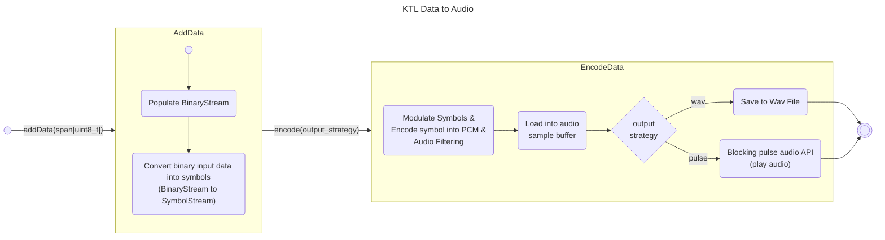
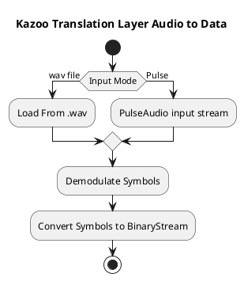

# Kazoo Translation Layer (KTL)

The KTL is responsible for translating between raw data and Kazoo audio. This is the real meat and potatoes of the
project.

```mermaid
---
title: KTL Data to Audio
---

flowchart LR
%%flowchart TD
    Start((" \n ")) -->|" addData(span[uint8_t]) "| AddData
    subgraph AddData
        AddData_Start((" \n ")) --> B
        B(Populate BinaryStream)
        C("Convert binary input data into symbols\n(BinaryStream to SymbolStream)")
        B --> C
    end

    AddData -->|" encode(output_strategy) "| EncodeData
    subgraph EncodeData
        Modulate("Modulate Symbols &\nEncode symbol into PCM &\nAudio Filtering")
        LoadAudioSampleBuffer(Load into audio\nsample buffer)
        Modulate --> LoadAudioSampleBuffer --> OutputStrategy
        OutputStrategy{output\nstrategy}
        OutputStrategy -->|" wav "| EncodeToWavFile
        OutputStrategy -->|" pulse "| EncodeToPulseAudio

    end
    stop((("\n")))
    EncodeToWavFile("Save to Wav File") --> stop
    EncodeToPulseAudio("Blocking pulse audio API\n(play audio)") --> stop

```

```puml
@startuml ktl_audio_to_data

title Kazoo Translation Layer Audio to Data

start

if (Input Mode) then (wav file)
  :Load From .wav;
else (Pulse)
  :PulseAudio input stream;
endif

:Demodulate Symbols;

:Convert Symbols to BinaryStream;

stop

@enduml
```