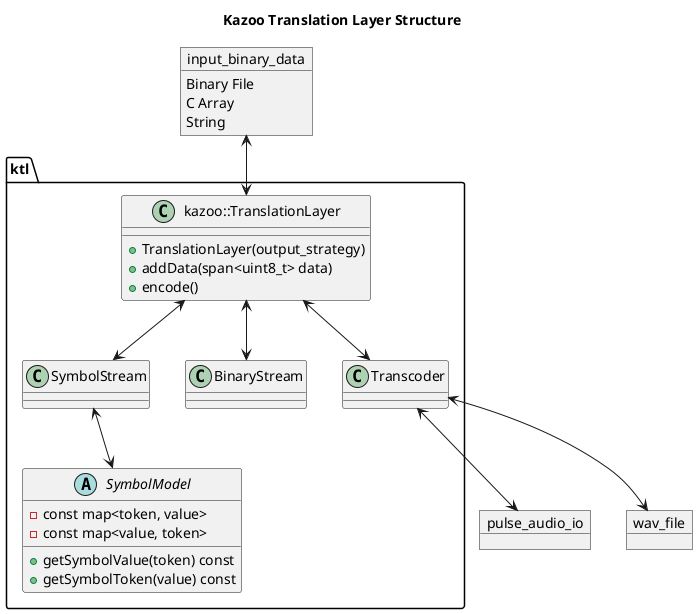
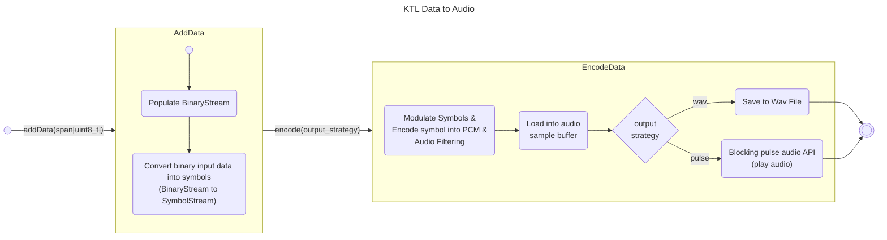
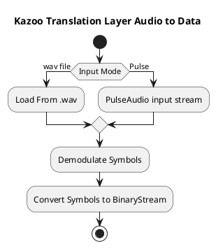

# Kazoo Translation Layer (KTL)

The KTL is responsible for translating between raw data and Kazoo audio. This is the real meat and potatoes of the
project.

It is implemented as a C++ library, via CMake as an interface library, with the target name `kazoo_translation_layer`.

## Structure / Design

