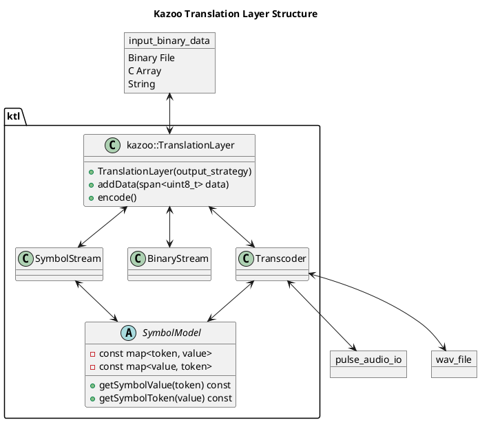
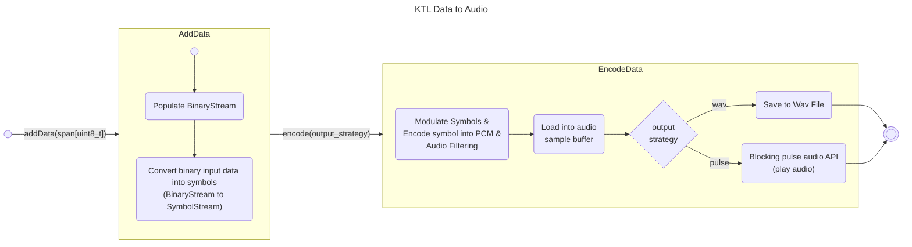
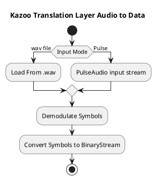

# Kazoo Translation Layer (KTL)

The KTL is responsible for translating between raw data and Kazoo audio. This is the real meat and potatoes of the
project.

It is implemented as a C++ library, via CMake as an interface library, with the target name `kazoo_translation_layer`.

## Public Interface: `ktl::TranslationLayer`

The entire translation layer is intended to be used through an instance of the class, `ktl::TranslationLayer`, which
can be found in `ktl/translation_layer.hpp`.

```c++
#include <array>

#include <ktl/translation_layer.hpp>

int main() {
    


    // Select the audio/symbol encoding model
    ktl::TranslationLayer tl{ktl::KazooModel::BINARY};
    
    // array, vector, or span of uint8_t
    std::array<uint8_t> input_data = {0x01, 0x02, 0x03, 0x04, 0x05};
    
    // Add the data to the data/symbol streams. This is accumulated until
    // encode() is called, at which point the data is encoded into an,
    // audio stream and the data/symbol streams are cleared.
    tl.addData(input_data); 
    
    // Encode the symbols into an audio stream. This will clear the data/symbol
    // streams and encode the data into an audio stream/buffer. This does not
    // clear the audio stream, it appends to it. It also does not play or export
    // the audio, it just encodes it into a buffer.
    tl.encode(); 
    
    // Save the audio to a wav file at the specified path. Does not clear the audio stream.
    tl.saveWav("output.wav");
    
    // Play the audio using pulse audio. This is a blocking call.
    tl.playPulseAudio();
    
    return 0;
}
```

## Models

- Testing Model & Binary Model
    - Models created for testing purposes. The Testing Model is aligned FSK.
- K1 Model
    - The first kazoo model. Two symbol/binary model @ 1 bit per symbol. 50 symbols per second. Has basic signal
      alignment abilities.

## Structure / Design





